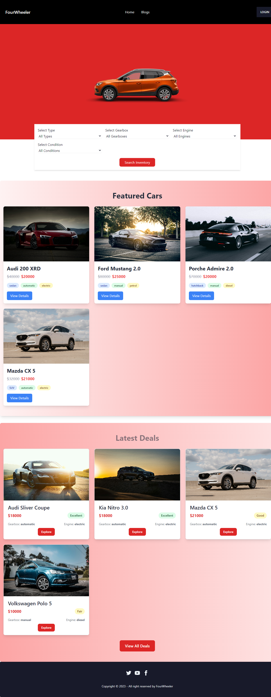
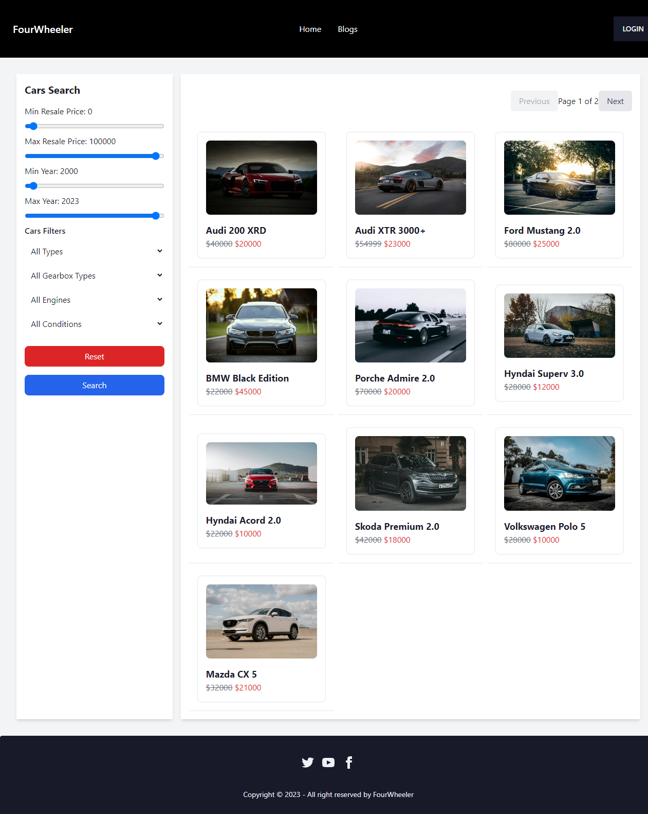
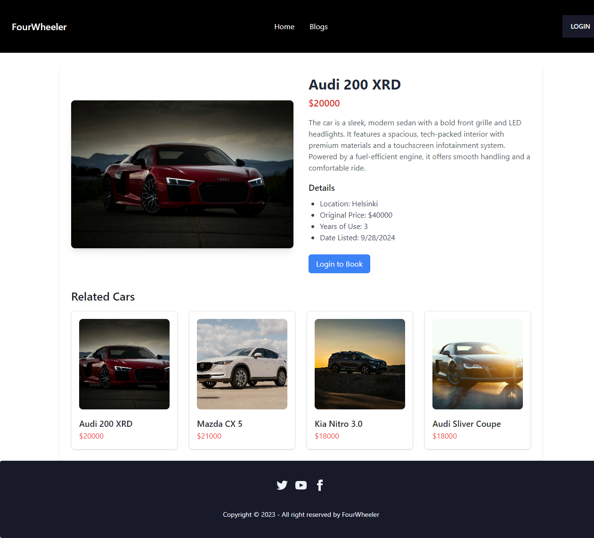
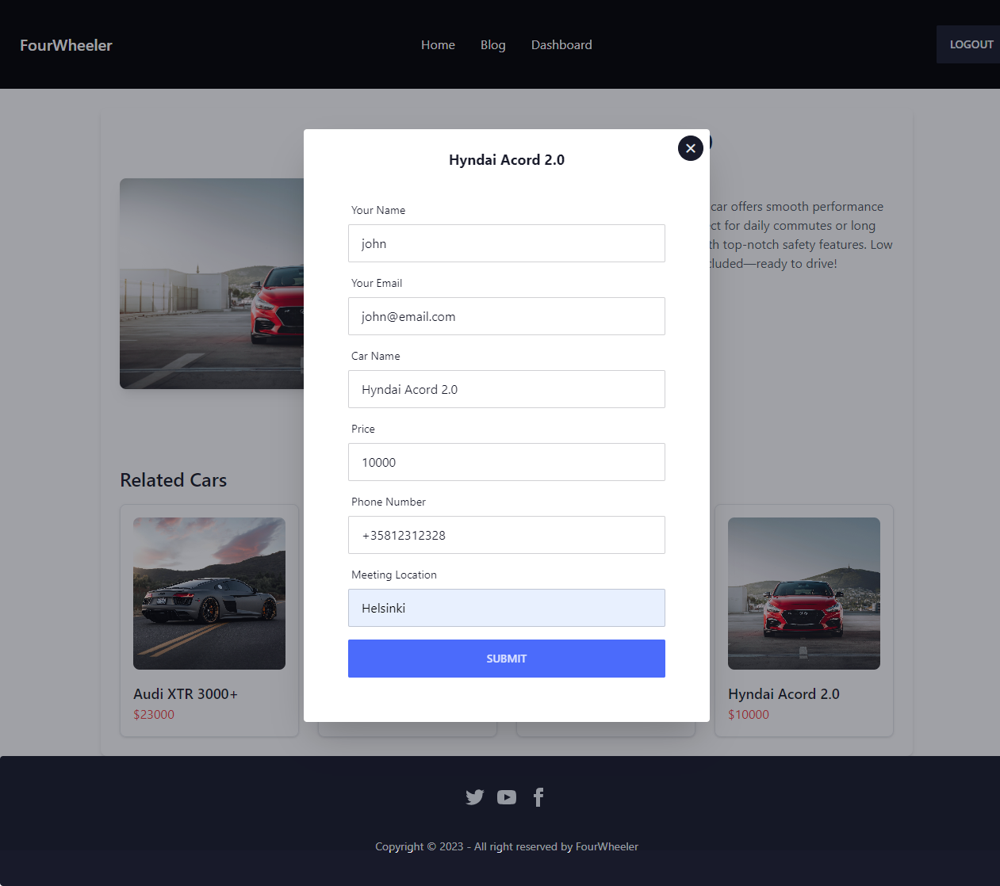
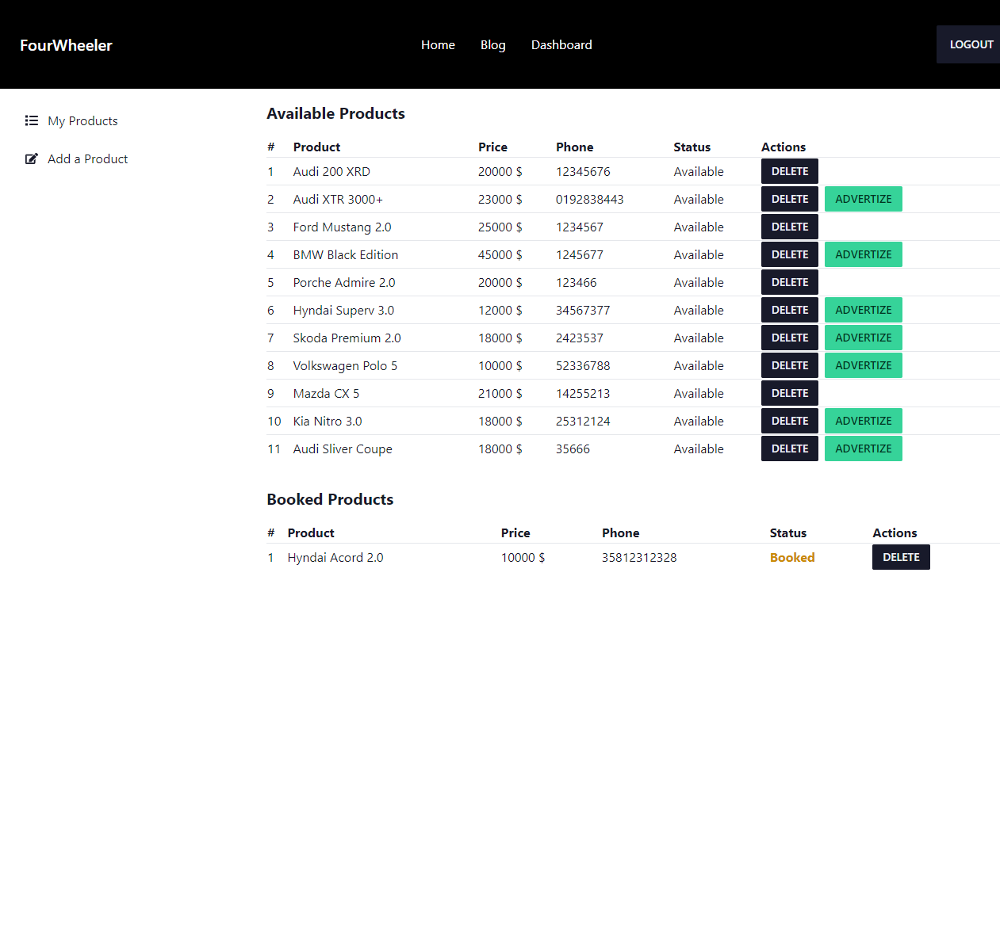
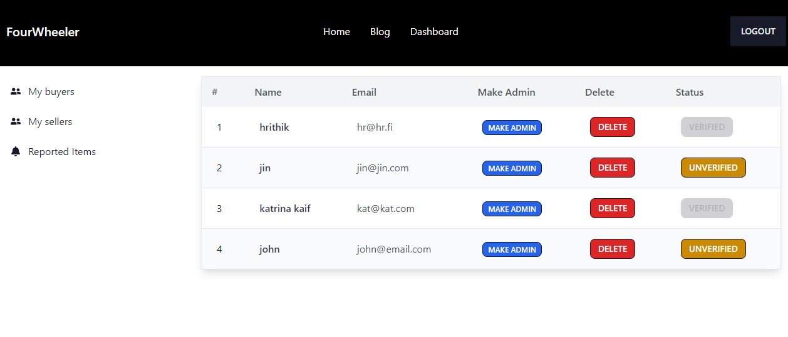

# 🚗 FourWheeler - Second Hand Car Buy and Sell Platform

This repository contains the **FourWheeler** project, a platform where users can buy and sell second-hand cars. It features distinct roles for buyers, sellers, and admins, providing different functionalities for each type of user.

### Live Deployment:

Explore the live deployment of the project by visiting [FourWheeler](https://four-wheeler-project.web.app/) 🚀

## Backend Repository

The backend repository handles all server-side logic, database interactions, and API endpoints necessary to support the FourWheeler platform. Built NodeJs, Express and MongoDB.

## You can find the backend repository at the following link: [FourWheeler Backend Repo](https://github.com/sanisaha/car-finder-server-MERN).

## Table of Contents

- [🌟 Features](#features)
- [🛠️ Tech Stack](#tech-stack)
- [📂 Project Structure](#project-structure)
- [🚀 Getting Started](#getting-started)
- [📸 Screenshots](#screenshots)

---

## Features

| Feature                 | Description                                                                                                                                                                                              |
| ----------------------- | -------------------------------------------------------------------------------------------------------------------------------------------------------------------------------------------------------- |
| **Buyer Account**       | Buyers can browse cars, book/purchase them, and view all their orders in the 'My Orders' section.                                                                                                        |
| **Seller Account**      | Sellers can list cars for sale, delete their listings, or advertise them. They can manage all their listed products in the 'My Products' section. _test Seller_ email: john@email.com password: password |
| **Admin Functionality** | Admins can manage buyers and sellers by removing accounts or promoting sellers to admins. _test Admin_ email: test@email.com password: password                                                          |
| **Authentication**      | Secure login and registration with Firebase authentication.                                                                                                                                              |
| **Responsive Design**   | A mobile-friendly UI built with Tailwind CSS for optimal user experience on all devices.                                                                                                                 |
| **MongoDB Integration** | NoSQL database (MongoDB) used for efficient data storage and retrieval.                                                                                                                                  |

---

## Tech Stack

| Category           | Technologies              |
| ------------------ | ------------------------- |
| **Frontend**       | - React.js                |
|                    | - Tailwind CSS            |
| **Backend**        | - Node.js                 |
|                    | - Express.js              |
|                    | - MongoDB                 |
| **Database**       | - MongoDB                 |
| **Authentication** | - Firebase Authentication |
| **Deployment**     | - Firebase Hosting        |

---

## Project Structure

```plaintext
src
├── assets
├── components
│   ├── CartItemCard.js
│   ├── RelatedItemPage.js
│   └── Spinner.js
├── Context
│   ├── AuthProvider.js
├── Firebase
├── Hooks
│   ├── useAdmin.js
│   ├── useBuyer.js
│   └── useSeller.js
├── Layout
│   ├── DashboardLayout
│   └── Main
├── Pages
│   ├── Blogs
│   ├── CarCategory
│   ├── Credentials
│   ├── Dashboard
│       ├── DashboardDetails
│       ├── MyDashboard
│       ├── MyOrders
│       ├── MySellers
│       ├── MyUsers
│       └── Payment
│   ├── Sellers
│       ├── AddProduct
│       └── MyProducts
│   ├── Home
│       ├── AdvertisedItems
│       └── Banner
│   ├── Other
│   ├── ProductDetails
│   ├── SearchPage
│   └── Shared
│       ├── Footer
│       └── Header
├── Routes
│   ├── AdminRoutes
│   ├── CommonRoutes
│   └── PrivateRoutes
└── App.js
```

## Getting Started

### Prerequisites

- #### Running backend server url

### Installation

1. _Clone the repository_:

```sh
git clone https://github.com/sanisaha/Car-finder-MERN
```

2. _Install the dependencies_:

```
npm install
```

3. _Change the API Request URL_:

To set the base URL for your backend server, follow these steps:

1. Open the file located at `Context/AuthProvider.js`.
2. Update the `baseURL` value to match your backend server URL. For example, if your backend server is running locally, set it as follows:

```typescript
export const baseURL = "http://localhost:5000"; //url could be different for yours
```

4. _start the project_:

```
npm start
```

## Screenshots

### Home Page - Latest Collection & Featured Section



### Cars Page - Cars with filters and pagination



### Detail Page - Single car detail and related items



### Booking Modal - Authenticated user can Book a Car



### Seller Dashboard - Create product and show own items and booked items



### Admin Dashboard - Manage Sellers and Buyers



---
